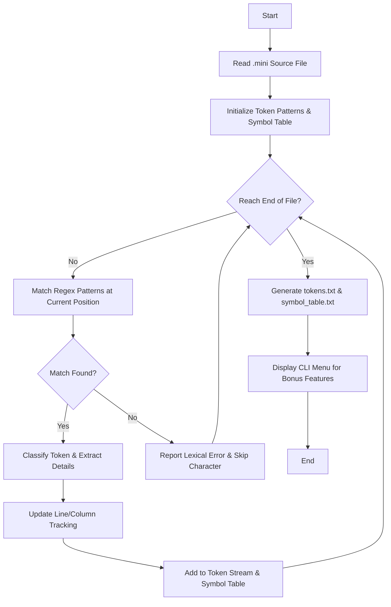

# Assignment Report: MiniLang Lexical Analyzer

## 1. Token Patterns Table
The following regular expressions are used to identify tokens in the MiniLang programming language:

| Token Type | Regex / Pattern | Description |
| :--- | :--- | :--- |
| **KEYWORD** | `int, float, char, if, else, for, while, return, break, continue` | Reserved words in MiniLang. |
| **IDENTIFIER** | `[A-Za-z_][A-Za-z0-9_]*` | Variable names, must start with letter/underscore. |
| **INTEGER_LITERAL** | `[0-9]+` | Whole numbers. |
| **FLOAT_LITERAL**| `[0-9]*\.[0-9]+` | Decimal numbers. |
| **OPERATOR** | `++  --  ==  !=  <  <=  >  >=  &&  \|\|  !  +=  -=  *=  /=` | Multi-character and single operators. |
| **SYMBOL** | `( ) { } [ ] , ; "` | Delimiters and special symbols. |
| **COMMENT** | `//.*` or `/\*[\s\S]*?\*/` | Single and multi-line comments (skipped). |

## 2. Flow Diagram of the Scanner
The lexical analyzer follows this logical flow to process the source file:

## 3. Implementation Details
- **Language**: Python 3.x
- **Core Library**: `re` (Regular Expressions)
- **Features**:
    - **Line & Column Tracking**: Accurately reports where each token begins.
    - **Error Detection**: Identifies invalid characters and reports them with line/column context.
    - **Symbol Table**: Automatically extracts unique identifiers and literals into a structured table.
    - **Bonus Features**: Includes a CLI menu to view statistics, cleaned source code, and specific token details.

## 4. Successful Execution Evidence
The program was tested with `test.mini` and produced the following outputs (stored in the workspace):
- `tokens.txt`: Full list of identified tokens.
- `symbol_table.txt`: Table containing variables and constants.

### Sample Statistics (Success)
The script successfully tokenizes nested logic and multi-line comments, which are common edge cases in lexical analysis.
